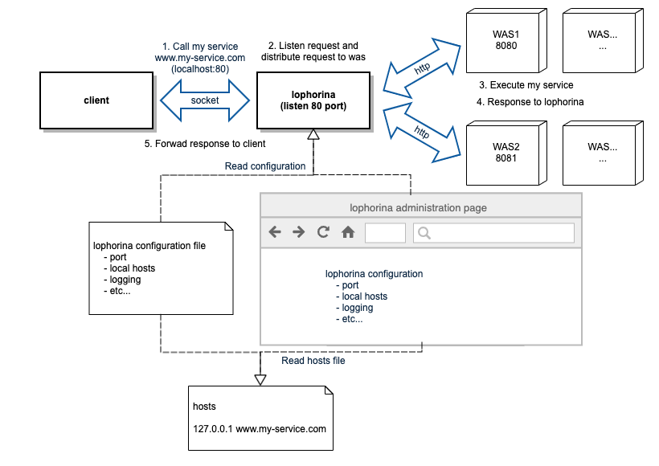

# lophorina

> Funny bird  
> [Lophorina : Superb Bird-of-Paradise](https://steemit.com/kr/@woongsfather/this-is-real-special-animal-the-bird-superb-bird-of-paradise)

## What is it?

lophorina is simple local load balancer. (L7)
- Distributing http request to local server and returning response to client.

### Feature

Simple configuration
- Using with minimum configuration.
    - target port (target count)
    - logging
- Providing simple GUI configuragion page.

Distributing request
- Distributing request Randomly.
- Distributing request to fixed rate.
    - A/B test
    - Canary test

Health check
- Checking the status of the connected service.

Logging
- logging request and response process.